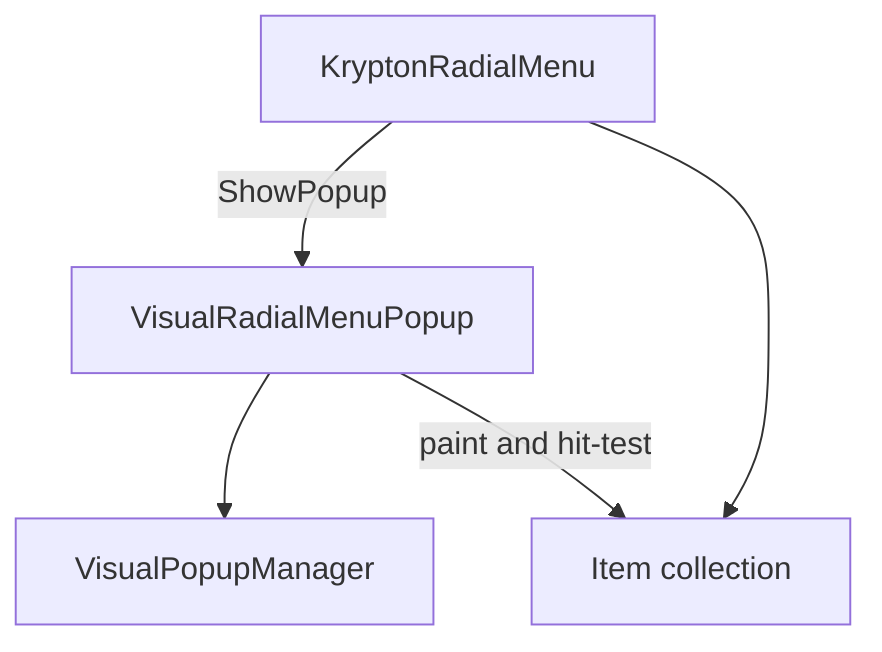

# Krypton Radial Menu — Developer Guide

## Overview

`KryptonRadialMenu` is a OneNote-style radial popup menu in the `Krypton.Toolkit.Utilities` assembly (issue [#4172](https://github.com/Krypton-Suite/Standard-Toolkit/issues/4172)). It is a designer `Component` (same role as `KryptonContextMenu`), not a form-hosted control and not tied to BarManager/Ribbon.

Consumers obtain it via the `Krypton.Standard.Toolkit` NuGet package (`Krypton.Toolkit.Utilities` assembly). There is no standalone Utilities NuGet package.

## Architecture

| Type | Role |
|------|------|
| `KryptonRadialMenu` | Public component: `Show` / `ShowPopup` / `Close`, lifecycle events, appearance proxies, context-menu import / live sync |
| `KryptonRadialMenuPresenter` | Opt-in app helper: `PreferRadialContextMenus` + `Show` for context menus |
| `KryptonRadialMenuItemCollection` | Restricted collection of radial item types |
| `KryptonRadialMenuItem` | Command sector with optional nested `Items` and `KryptonCommand` |
| `KryptonRadialMenuSliderItem` | Arc slider editor when activated |
| `KryptonRadialMenuColorPaletteItem` | Colour swatch ring (`ColorScheme` aligned with context-menu colour columns) |
| `KryptonRadialMenuFontListItem` | Scrollable font-family ring |
| `VisualRadialMenuPopup` | Internal `VisualPopup` host with circular `Region`, circular shadow paths, keyboard navigation |
| `KryptonRadialMenuContextMenuBridge` | Projects supported `KryptonContextMenuItemBase` types into radial items |
| `RadialLayoutEngine` / `RadialMenuPainter` | Equal-angle annular sectors and GDI+ painting |



## Public API

### Showing and closing

```csharp
var menu = new KryptonRadialMenu();
menu.Items.Add(new KryptonRadialMenuItem("Save", (_, _) => Save()));
menu.Show(this);                    // centred on mouse
menu.Show(this, clientPoint);       // centred on control client point (converted to screen)
menu.ShowPopup(this, screenPt, animated: true);
menu.Close();
```

### Appearance

- `MenuRadius` / `InnerRadius` — outer and centre radii (also under `Values`)
- `Glyph` — centre image at the root level
- `MenuColor` / `SubMenuHoverColor` — accents (empty uses defaults)
- `DisplayStyle` — `Text`, `Image`, `ImageAboveText`, `TextAboveImage`
- `ItemImageSize` — sector icon size in pixels (default `24`)
- Per-item `Image` / `ImageTransparentColor` on any slice; `KryptonRadialMenuItem` also resolves `KryptonCommand.ImageSmall` / `ImageLarge` when `Image` is unset (`LargeKryptonCommandImage`)
- `ShowShadow` — circular `VisualPopupShadow` paths (default `true`; applied when the popup is created)
- `ShowCheckedGlyph` — draws a ✓ on checked sectors (default `true`)
- `PaletteMode` / `LocalCustomPalette` — resolved for the popup renderer
- `AllowMove` — when `true`, drag the centre button to reposition the open menu; a click without dragging still backs/closes
- `Values.AnimationStyle` / `AnimationDuration` — `None`, `FadeScale`, `Sweep` (default), `Spiral`, `Pop`; also plays when navigating rings
- `Values.SubMenuGlyph` — Unicode character drawn on the outer ring for items that open a submenu or editor (default `›`)
- `Values.OuterRingThickness` — outer ring stroke thickness (default `4`, colour from `PanelAlternate`)
- Slices fill from `PanelClient`; outer ring from `PanelAlternate`
- Per-item `ToolTipValues` / `ToolTipText` — Krypton `VisualPopupToolTip` on hover (`EnableToolTips` required)

### Events

- `Opening` / `Opened` / `Closing` / `Closed`
- `ItemClick` — any activated item
- `CenterButtonClick` — root centre click (before close)
- Per-item: `Click`, `ValueChanged`, `SelectedColorChanged`, `SelectedFontChanged`

### Interaction model

1. Equal-angle sectors for visible items; centre button closes at root or navigates back.
2. Parent `KryptonRadialMenuItem` with children opens a child ring (replace-in-place).
3. Slider / colour / font items open an editor ring; centre returns to the previous ring.
4. Outside click, Alt, or Escape dismisses via `VisualPopupManager`.
5. Keyboard: Left/Right/Up/Down move focus; Home/End jump; Enter/Space activate; Back backs out; Escape backs out of nested/editor levels, then dismisses at root.

## Context-menu bridge

```csharp
var radial = KryptonRadialMenu.FromContextMenu(existingContextMenu);
// or
radial.ImportFrom(existingContextMenu);
// live collection sync (re-projects on Inserted/Removed/Cleared/Reordered):
radial.ImportFrom(existingContextMenu, liveSync: true);
radial.RefreshFromContextMenu();
```

Import builds **copies / projections** for display. Live dual-hosting of the same item instance in both linear and radial UIs is not supported.

### Opt-in radial presentation helper

```csharp
KryptonRadialMenuPresenter.PreferRadialContextMenus = true;
KryptonRadialMenuPresenter.Show(contextMenu, this, clientPoint);
```

This does **not** rewrite every toolkit host that calls `KryptonContextMenu.Show` directly — call sites must use the presenter (or their own import) when they want radial presentation.

### Mapping table

| Source | Radial result |
|--------|----------------|
| `KryptonContextMenuItems` | Children flattened into the current level |
| `KryptonContextMenuItem` | `KryptonRadialMenuItem` (click invokes `source.PerformClick`) |
| `KryptonContextMenuLinkLabel` | `KryptonRadialMenuItem` (`PerformClick`) |
| `KryptonContextMenuCheckBox` / `CheckButton` / `RadioButton` | Checked-style `KryptonRadialMenuItem` |
| `KryptonContextMenuColorColumns` | `KryptonRadialMenuColorPaletteItem` |
| `KryptonContextMenuImageSelect` | Parent item with per-image children setting `SelectedIndex` |
| `KryptonContextMenuComboBox` | Parent item with children for each entry (`SelectedIndex`) |
| `KryptonContextMenuTextBox` | Display-only sector (text + tooltip); not an in-ring editor |
| `KryptonContextMenuProgressBar` | Disabled display sector (`Value/Maximum`) |
| `KryptonContextMenuMonthCalendar` | Display sector for the current selection range |
| `Heading`, `Separator` | Skipped |

## Validation

TestForm demo: **Radial Menu (#4172)** (`RadialMenuDemo`), registered in `StartScreen.AddButtons()`.

Manual steps:

1. Open the demo; leave **Native radial items** selected.
2. Right-click the surface — confirm nested Edit, Bold check + glyph, Opacity/colour/font editors, disabled sector, images.
3. Exercise DisplayStyle / ItemImageSize / Show shadow / Checked glyph / Animation.
4. Use arrow keys + Enter while the menu is open; Esc backs out then dismisses.
5. Switch to **Imported from KryptonContextMenu** — confirm Open/Save/More, LinkLabel, TextBox/Combo/Progress/Calendar, colour import; separators absent.
6. Enable **PreferRadialContextMenus** and right-click again to exercise `KryptonRadialMenuPresenter`.

Unit-test helpers: `Scripts/UnitTests/Start-RadialMenuDemoHost.ps1`, `Scripts/UnitTests/Invoke-RadialMenuScreenshot.ps1`.

## Edge cases

- Empty `Items` still shows a centre-only popup that closes on centre click.
- Bridged command items do not copy `KryptonCommand` onto the radial item (avoids double execute); they call `PerformClick` on the source.
- Font list shows up to eight families at a time; mouse wheel scrolls the list.
- Circular `Region` clips the popup; shadow uses three concentric ellipse paths when `ShowShadow` is true.
- `ShowShadow` is read when the popup is constructed — change it before the next `Show`.
- Packaging remains the `Krypton.Standard.Toolkit` NuGet package (no standalone Utilities package).
