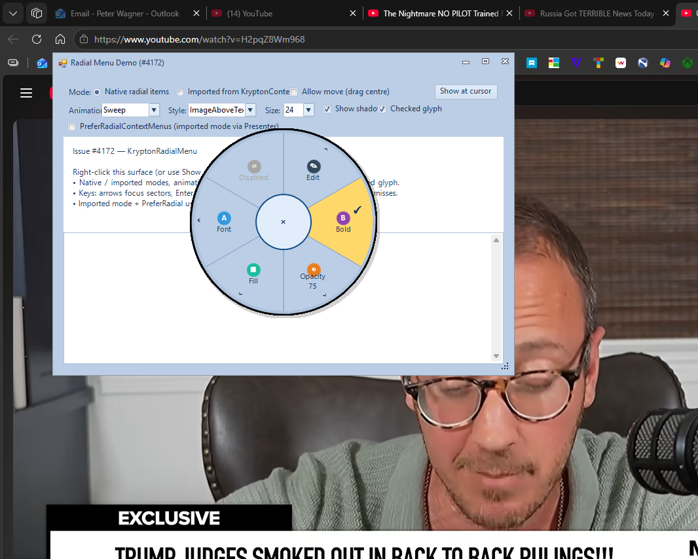

# Feature: Add KryptonRadialMenu (#4172)

## Summary

Adds a OneNote-style radial popup menu (`KryptonRadialMenu`) to `Krypton.Toolkit.Utilities`, with nested submenus, optional `KryptonCommand` binding, Syncfusion-style slider/colour/font editor items, animations, sector images, circular shadow, keyboard navigation, and `ImportFrom` / `FromContextMenu` bridging (with optional live sync) plus `KryptonRadialMenuPresenter` for opt-in radial presentation of context menus.

## Related issues

- Closes #4172

## Type of change

- [x] Feature / enhancement (`Implemented`)

## Changes

- **Krypton.Toolkit.Utilities:** New `Components/Krypton Radial Menu/` feature — public component and item types, circular `VisualPopup` host (circular shadow paths), layout/painter, context-menu bridge, presenter helper, designer and collection editor.
- **TestForm:** `RadialMenuDemo` registered on the start screen (native items vs imported context menu, display/animation/shadow controls).
- **Docs:** Developer guide under `Documents/Development/`; changelog entry for #4172.
- **Scripts/UnitTests:** Host + screenshot helpers for the demo.

## Affected packages & target frameworks

- Packages: `Krypton.Toolkit.Utilities`, `TestForm`
- TFMs verified: `net472` (Utilities + TestForm targeted builds)

## Validation

- TestForm demo: `RadialMenuDemo` (registered in `StartScreen.AddButtons()` as **Radial Menu (#4172)**).
- Manual steps:
  1. Right-click the demo surface in native mode — exercise nested Edit, Bold (checked glyph), slider, colour, font, disabled item, images.
  2. Toggle Animation / DisplayStyle / ItemImageSize / Show shadow / Checked glyph.
  3. Arrow keys + Enter; Esc backs nested levels then dismisses.
  4. Switch to imported mode — confirm expanded bridge mapping and skipped separators.
  5. PreferRadialContextMenus via presenter.
- Build: `dotnet build ".\Source\Krypton Components\TestForm\TestForm.csproj" -c Debug -f net472`

## Screenshots / GIFs

(Capture with `Scripts/UnitTests/Invoke-RadialMenuScreenshot.ps1` if regenerating.)

## Changelog

- Entry added to `Documents/Changelog/Changelog.md` for #4172 (radial menu + follow-up capabilities).

## Breaking changes & migration

None.

## Developer documentation

- `Documents/Development/Krypton-Radial-Menu-Developer-Guide.md`

## Checklist

- [x] Builds for `net472` and is C# 7.3 compatible where required
- [x] New compiler/analyzer warnings in touched code addressed
- [x] `Documents/Changelog/Changelog.md` updated
- [x] TestForm demo added or updated (features / observable bug fixes)
- [x] `Documents/Development/` guide added (substantial features)
- [x] Screenshots/GIFs included (UI changes)
- [x] Breaking-change impact and TFM notes documented above
