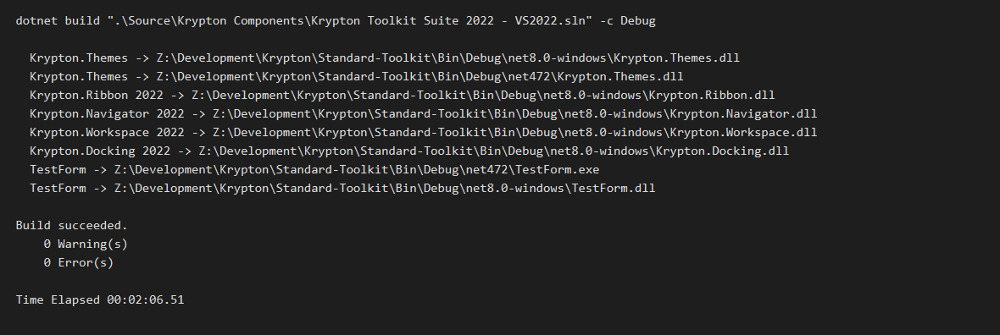
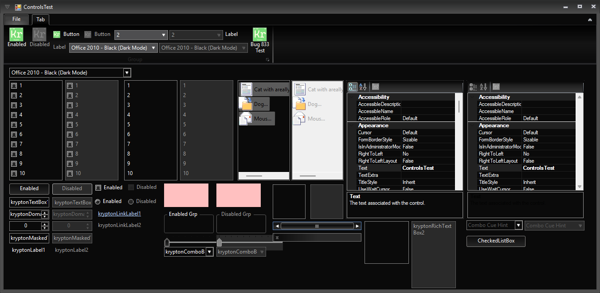
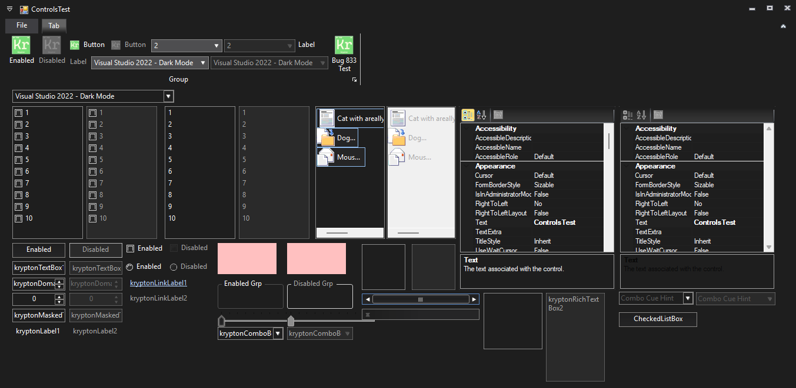
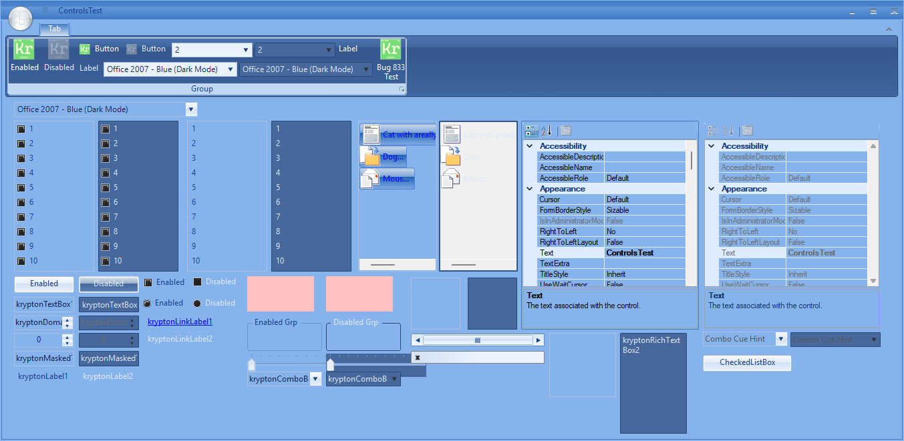
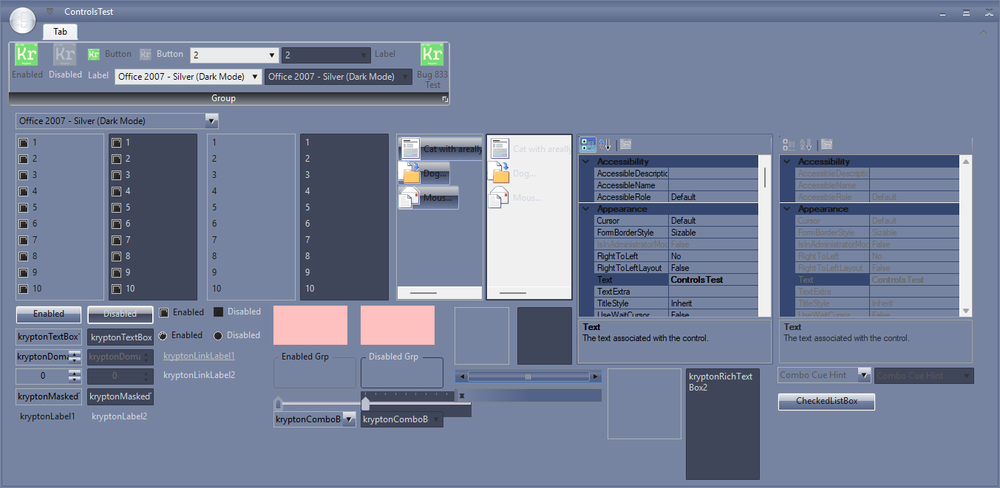
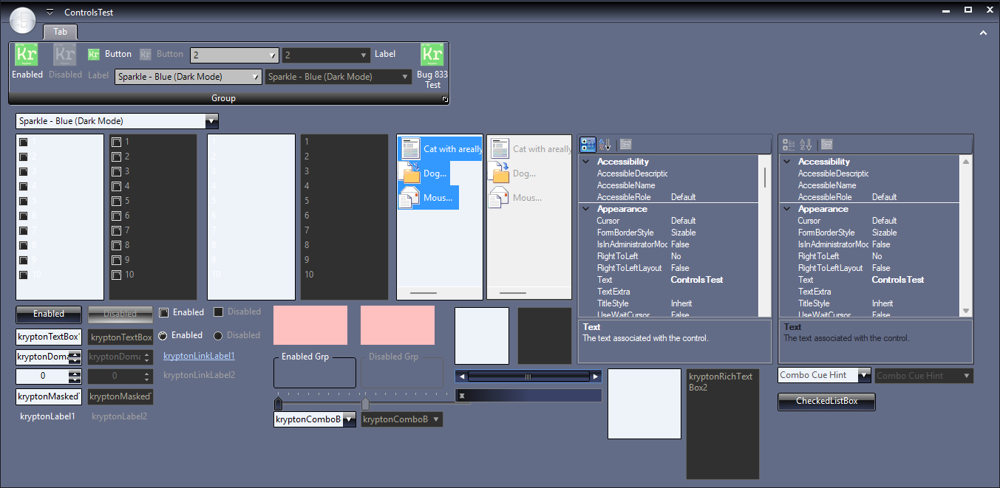
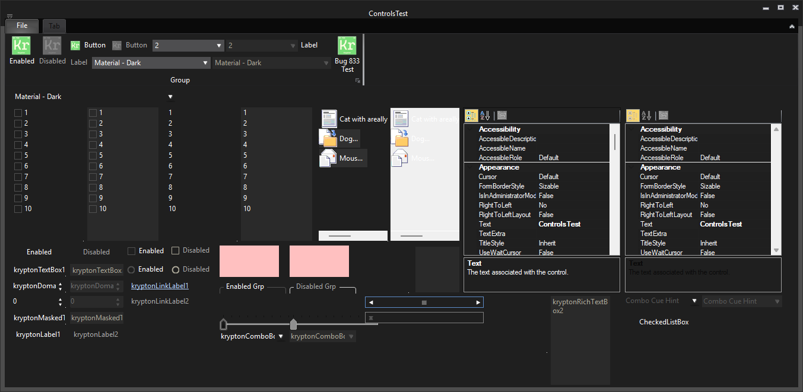
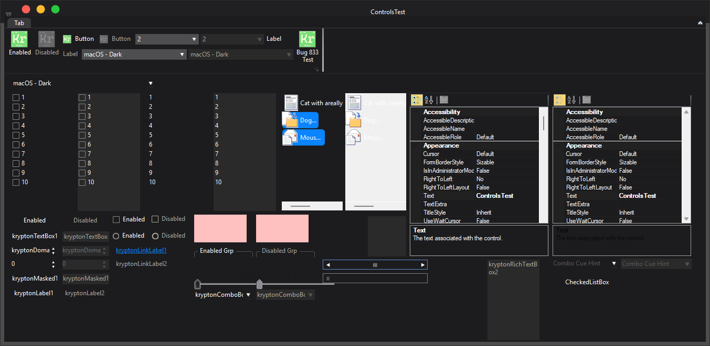

# Fix: Dark mode theme contrast (#4483)

## Summary

Dark mode palettes no longer leave light Office chrome on a dark surface. Separators, grid rows, disabled inputs, tabs, and checkbox/radio glyphs follow the dark face. Office glass buttons and the silver group caption stay, with dark caption text so the gloss remains readable.

## Related issues

- Closes #4483

## Type of change

- [x] Bug fix (`Resolved`)
- [ ] Feature / enhancement (`Implemented`)
- [ ] **Breaking change** (API removal/rename, behavior change requiring migration, assembly/namespace move)
- [ ] Documentation only

## Changes

- `Krypton.Themes`: Office 2007/2010 Black, Microsoft 365 Black and Black Alternate, Visual Studio 2012–2026 Dark, Material Dark, and macOS Dark use dark separators, grips, grid rows, navigator buttons, disabled input fills, and tab pages.
- Office 2007/2010 and Microsoft 365 Blue and Silver dark modes keep their blue and slate identity. Near-white ribbon sheets, headers, and disabled fills are pulled toward that family colour, and input text is no longer blue-on-blue or white-on-slate.
- Sparkle Blue, Orange, and Purple dark modes keep the light glossy buttons. Grid rows, headers, and the shared light disabled fill are darkened.
- Checkbox and radio strips are recolored in `DarkSelectionGlyph` so the box is dark and the mark stays light, keeping a blue tick blue.
- Office glass styles are unchanged. Silver group captions keep dark caption text.

## Affected packages & target frameworks

- Packages: `Krypton.Themes` (renders through `Krypton.Toolkit`).
- TFMs verified: full Debug suite solution (`net472`, `net48`, `net481`, `net8.0-windows`, `net9.0-windows`, `net10.0-windows`, `net11.0-windows`).

## Validation

- TestForm: `ControlsTest`. Switch the ribbon theme combo through the dark modes above.
- Manual steps:
  1. Open ControlsTest and select a dark mode.
  2. Confirm buttons still show the Office or Sparkle gloss where that family has it, and the group caption text is readable.
  3. Confirm disabled labels, inputs, checkboxes, and radio buttons are visible, and grid rows, separators, and tabs are not white sheets.
- Build: `dotnet build ".\Source\Krypton Components\Krypton Toolkit Suite 2022 - VS2022.sln" -c Debug`



## Screenshots / GIFs















## Changelog

- Entry added to `Documents/Changelog/Changelog.md`:

```markdown
* Resolved [#4483](https://github.com/Krypton-Suite/Standard-Toolkit/issues/4483), Dark mode themes no longer leave light Office chrome on dark surfaces. Office glass buttons and silver group captions stay. Disabled text, separators, grid rows, tabs, and checkbox/radio glyphs are darkened so they stay readable.
```

## Breaking changes & migration

None. Colour values inside the dark palettes changed. Public API is unchanged.

## Developer documentation

Not required. This is a palette contrast fix, not a new API.